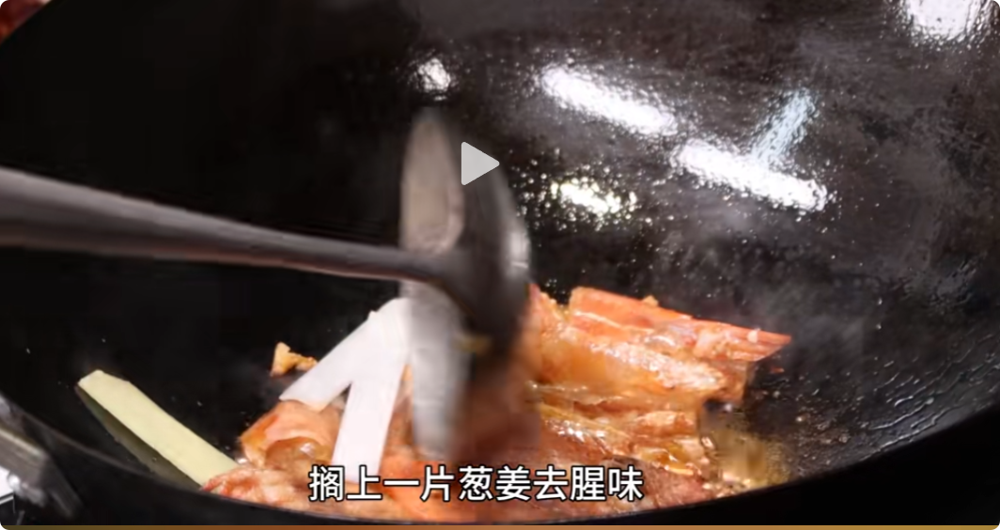

> 虾肉紧实Q弹，白菜软烂入味，汤汁浓郁飘香。

## 食材准备

- 大虾：剪掉虾枪，去掉虾胃，虾背开线，虾头剪下来单独放
- 白菜：白菜梆比较硬，片开

## 开始做

1. 煸油：锅里下油，放入虾头，用铲子按压虾头，煸出虾油，放入几片葱姜去腥，然后加水（最好是温水），熬至汤汁浓郁，盛出

2. 锅里放底油，放入白菜，炒软，盛出。
3. 锅里下油，放入虾身，中火煎熟，放入几片葱姜，煎透后加入虾汤，加入白菜，加入盐，白糖调味，中火㸆至软烂（约5分钟），中大火收汁，勾芡出锅。
