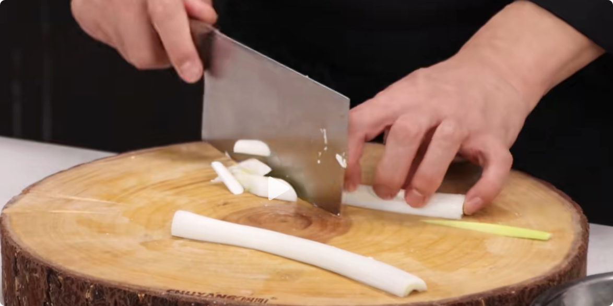
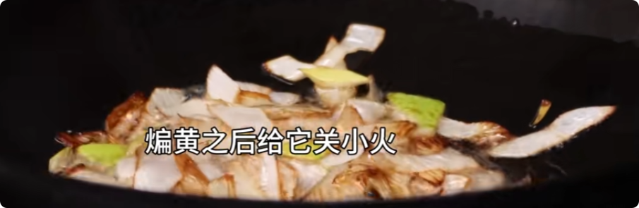
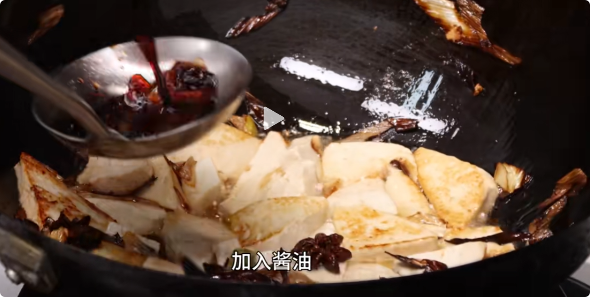
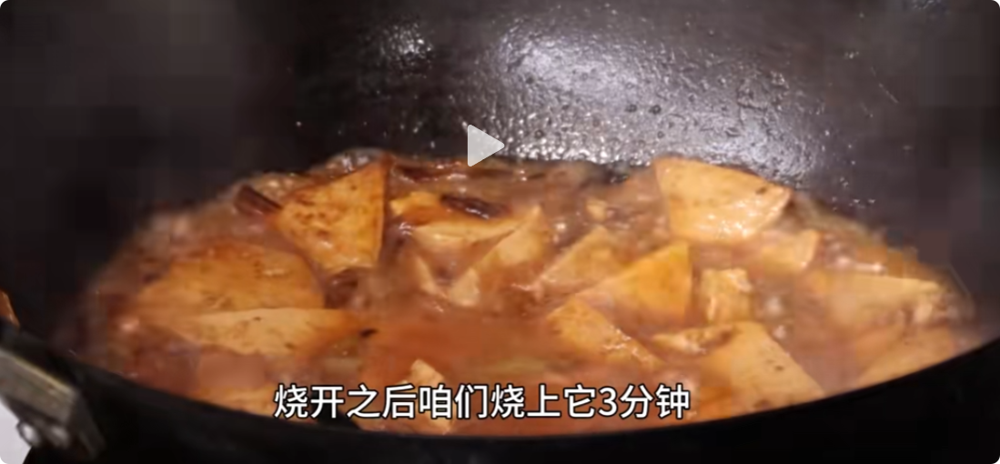

# 食材准备

- 大葱一根：葱白部分从中间剖开，去掉绿芯，斜切成眉毛葱

- 老豆腐一块：切成三角块

- 辅料：两个八角

# 做法

1. 煸香：热锅加油，油热加入八角和一半的葱，中小火煸至葱变黄

2. 煎豆腐：关小火后，豆腐沿一边下锅，小火煎至两面金黄

3. 调味：加入酱油（生抽老抽都可），烹香，翻炒，使豆腐入味
4. 煮：加水没过豆腐，（喜欢咸口的这里可以加点盐），煮约3-5分钟，煮到汤汁见底即可。

5. 勾芡：加入剩下一半的葱，加入少许水淀粉，翻炒均匀，即可出锅。

